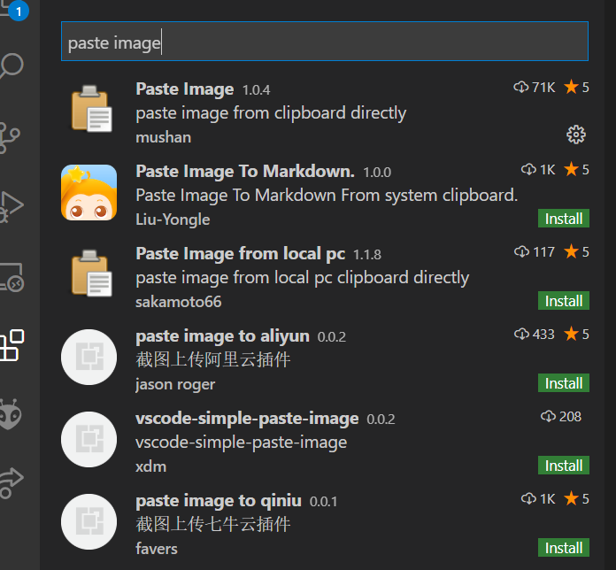
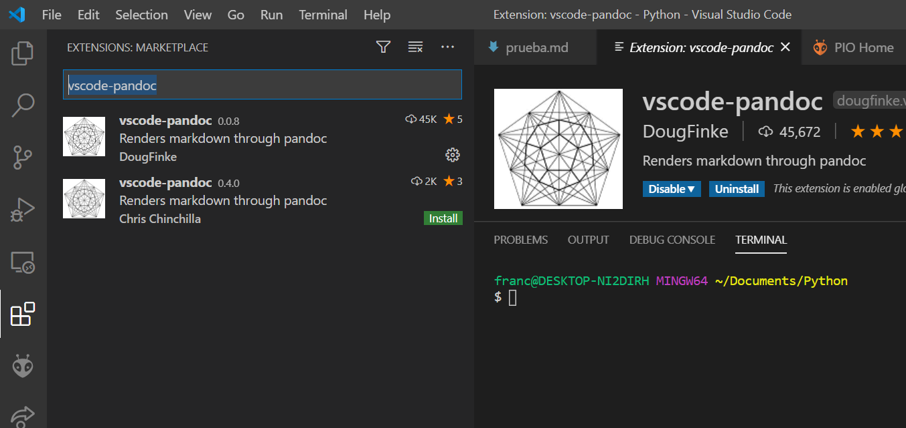

# Tips para documentos markdown

## 1. pegar fotos directamente desde el clipboard

Esto se hace por medio de la extension de VSCODE como se ve en la imagen



una vez instalada la extension, reinica vscode y trabaja en tu archivo markdown. cuando quieras agregar una nueva imagen presiona ctr+alt+v (en windows) y la extension se encargará de ingresar la imagen en el archivo markdown. 

**se hace referencia al creador de esta extension por medio del siguiente [link](https://marketplace.visualstudio.com/items?itemName=mushan.vscode-paste-image)**


## 2. exportar archivos markdown como pdf word o html

para lograrlo debemos instalar la extension vscode-pandoc





### 2.1 Uso

1. situate en algun lugar de tu archivo markdown.
2. luego presiona f1 (en windows) seguido de esto escribe "pandoc render" y presiona enter
3. tendrás la opcion de escoger entre pdf, html o word. escoge la extension que mas te guste.


para mas informacion te invito a hacer clic en el siguiente **[GIF](https://raw.githubusercontent.com/dfinke/vscode-pandoc/master/images/vscodePandoc.gif)** 


## 3. tables in md

tables in markdown, coming from 
[markdwon guides](https://www.markdownguide.org/extended-syntax/)

en un ejemplo sencillo puedes hacer la siguiente tabla 

| Syntax      | Description | Test Text     |
| :---        |    :----:   |          ---: |
| Header      | Title       | Here's this   |
| Paragraph   | Text        | And more      |

por medio de este codigo, sencillo eh? :)

```| Syntax      | Description | Test Text     |
| :---        |    :----:   |          ---: |
| Header      | Title       | Here's this   |
| Paragraph   | Text        | And more      |
```

## 4. Insertar un video de youtube

puedes ingresar directamente el codigo HTML
```
<a href="http://www.youtube.com/watch?feature=player_embedded&v=YOUTUBE_VIDEO_ID_HERE
" target="_blank"></a>
````
que se vera asi

<a href="http://www.youtube.com/watch?feature=player_embedded&v=q5PjWMqaujc
" target="_blank"></a>

